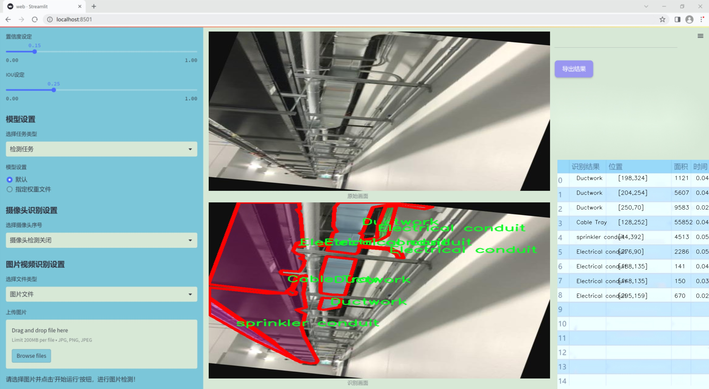
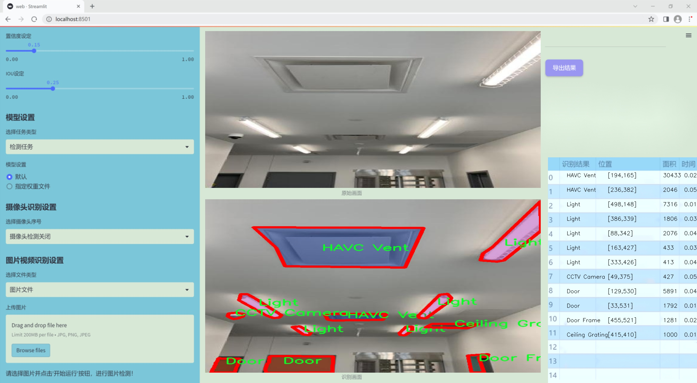
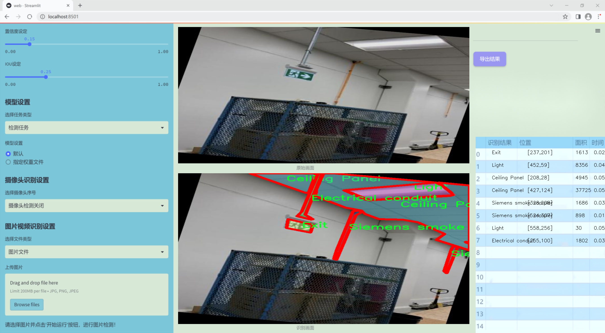
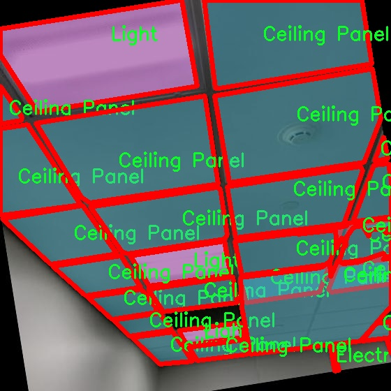
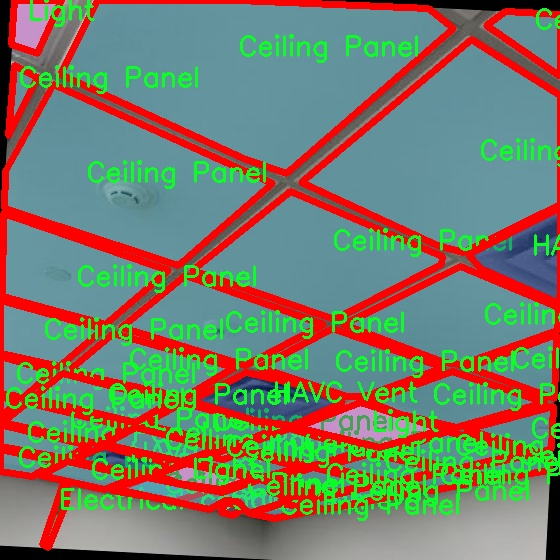
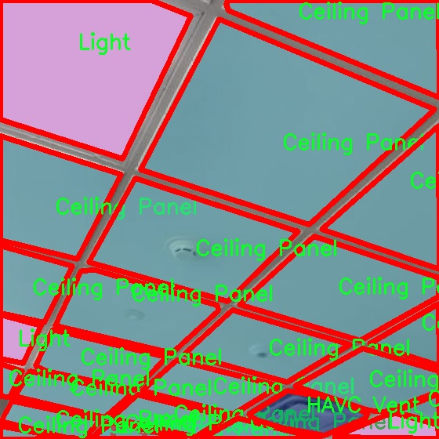
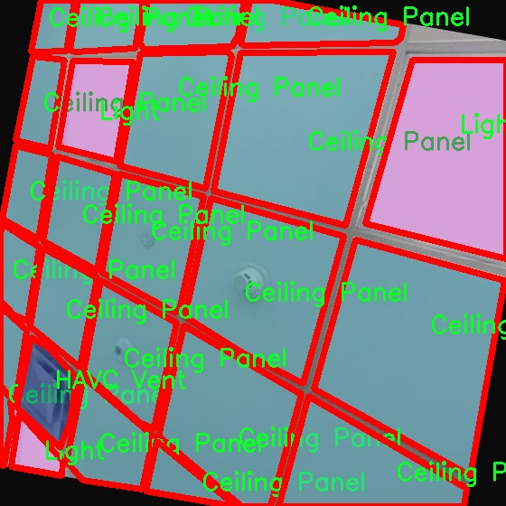
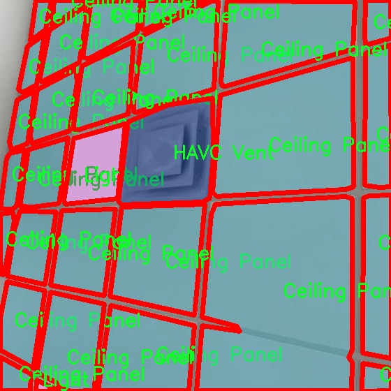

### 1.背景意义

研究背景与意义

随着城市化进程的加快，建筑物的复杂性和多样性不断增加，建筑内部的物体检测变得愈发重要。传统的人工检测方法不仅效率低下，而且容易受到人为因素的影响，导致检测结果的不准确。因此，基于深度学习的自动化物体检测技术逐渐成为研究的热点，尤其是在建筑物内部环境中。YOLO（You Only Look Once）系列模型因其高效的实时检测能力和良好的准确性，成为了物体检测领域的主流选择。

本研究旨在基于改进的YOLOv11模型，构建一个高效的建筑物内部物体检测系统。该系统将能够识别和定位建筑内部的多种物体，包括但不限于门、窗、管道、灯具、灭火器等，共计47个类别。这些物体在建筑物的安全、维护和管理中扮演着重要角色，准确的检测能够为建筑物的智能管理提供数据支持，提升管理效率。

在数据集方面，本研究使用了包含1400张经过精细标注的图像，涵盖了建筑内部的多种结构和设备。这些图像经过了多种预处理和增强技术，确保了模型训练的多样性和鲁棒性。通过利用先进的计算机视觉技术，系统将能够实时监测建筑内部的物体状态，及时发现潜在的安全隐患，从而为建筑物的安全管理提供有力保障。

此外，随着智能建筑和物联网技术的发展，建筑物内部的物体检测系统将与其他智能系统相结合，实现更高层次的自动化和智能化管理。研究的成果不仅能够推动建筑物管理技术的进步，也将为相关领域的研究提供新的思路和方法，具有重要的理论意义和实际应用价值。

### 2.视频效果

[2.1 视频效果](https://www.bilibili.com/video/BV1mPrZYDEgG/)

### 3.图片效果







##### [项目涉及的源码数据来源链接](https://kdocs.cn/l/cszuIiCKVNis)**

注意：本项目提供训练的数据集和训练教程,由于版本持续更新,暂不提供权重文件（best.pt）,请按照6.训练教程进行训练后实现上图演示的效果。

### 4.数据集信息

##### 4.1 本项目数据集类别数＆类别名

nc: 47
names: ['Access Card reader', 'Access panel', 'Base mould', 'CCTV Camera', 'Cable Tray', 'Cagewall', 'Ceiling Grating', 'Ceiling Panel', 'Closet', 'Concrete', 'Door', 'Door Frame', 'Drywall', 'Ductwork', 'Electrical Power Panel', 'Electrical conduit', 'Exit', 'Fire Extinguisher', 'Floor', 'Floor tiles', 'HAVC Vent', 'Hanging Lights', 'Insulation', 'Light', 'Millwork', 'Person', 'Quartz Stone', 'Siemens smoke sampler', 'Sink', 'Stairs', 'Stone Masonry', 'Unit Heat', 'Vent', 'Wall guard', 'Wall tiles', 'acoustic panels', 'beam-concrete', 'beam-formwork', 'beam-rebar', 'columns-concrete', 'columns-formwork', 'columns-rebar', 'object', 'sprinkler conduit', 'wall-concrete', 'wall-formwork', 'wall-rebar']


该项目为【图像分割】数据集，请在【训练教程和Web端加载模型教程（第三步）】这一步的时候按照【图像分割】部分的教程来训练

##### 4.2 本项目数据集信息介绍

本项目数据集信息介绍

本项目旨在改进YOLOv11的建筑物内部物体检测系统，所使用的数据集主题为“ML const”，其设计目的是为了增强在复杂建筑环境中对多种物体的识别能力。该数据集包含47个类别，涵盖了建筑内部的各种元素，提供了丰富的样本以支持模型的训练和验证。具体类别包括但不限于：门、窗框、墙壁、天花板、地板、以及各种电气和消防设备，如CCTV摄像头、火灾灭火器和电源面板等。这些类别的选择不仅反映了建筑内部的常见构件，也考虑到了现代建筑设计中的智能化和安全性需求。

数据集中每个类别的样本数量经过精心挑选，以确保模型在训练过程中能够接触到多样化的场景和物体。这种多样性对于提高模型的泛化能力至关重要，尤其是在面对不同建筑风格和布局时。数据集中的“人”类别也为模型提供了动态元素，使其能够在实际应用中更好地适应人流量变化和人机交互场景。

此外，数据集还包含了一些特定的建筑构件，如声学面板、混凝土梁、柱子及其不同的构造形式（如模板和钢筋），这些元素的细致分类有助于模型在复杂环境中进行精确的物体检测。通过使用该数据集进行训练，改进后的YOLOv11模型将能够更准确地识别和定位建筑内部的各种物体，从而为智能建筑管理、安防监控及维护保养提供强有力的技术支持。











### 5.全套项目环境部署视频教程（零基础手把手教学）

[5.1 所需软件PyCharm和Anaconda安装教程（第一步）](https://www.bilibili.com/video/BV1BoC1YCEKi/?spm_id_from=333.999.0.0&vd_source=bc9aec86d164b67a7004b996143742dc)


[5.2 安装Python虚拟环境创建和依赖库安装视频教程（第二步）](https://www.bilibili.com/video/BV1ZoC1YCEBw?spm_id_from=333.788.videopod.sections&vd_source=bc9aec86d164b67a7004b996143742dc)

### 6.改进YOLOv11训练教程和Web_UI前端加载模型教程（零基础手把手教学）

[6.1 改进YOLOv11训练教程和Web_UI前端加载模型教程（第三步）](https://www.bilibili.com/video/BV1BoC1YCEhR?spm_id_from=333.788.videopod.sections&vd_source=bc9aec86d164b67a7004b996143742dc)


按照上面的训练视频教程链接加载项目提供的数据集，运行train.py即可开始训练



     Epoch   gpu_mem       box       obj       cls    labels  img_size
     1/200     20.8G   0.01576   0.01955  0.007536        22      1280: 100%|██████████| 849/849 [14:42<00:00,  1.04s/it]
               Class     Images     Labels          P          R     mAP@.5 mAP@.5:.95: 100%|██████████| 213/213 [01:14<00:00,  2.87it/s]
                 all       3395      17314      0.994      0.957      0.0957      0.0843

     Epoch   gpu_mem       box       obj       cls    labels  img_size
     2/200     20.8G   0.01578   0.01923  0.007006        22      1280: 100%|██████████| 849/849 [14:44<00:00,  1.04s/it]
               Class     Images     Labels          P          R     mAP@.5 mAP@.5:.95: 100%|██████████| 213/213 [01:12<00:00,  2.95it/s]
                 all       3395      17314      0.996      0.956      0.0957      0.0845

     Epoch   gpu_mem       box       obj       cls    labels  img_size
     3/200     20.8G   0.01561    0.0191  0.006895        27      1280: 100%|██████████| 849/849 [10:56<00:00,  1.29it/s]
               Class     Images     Labels          P          R     mAP@.5 mAP@.5:.95: 100%|███████   | 187/213 [00:52<00:00,  4.04it/s]
                 all       3395      17314      0.996      0.957      0.0957      0.0845


###### [项目数据集下载链接](https://kdocs.cn/l/cszuIiCKVNis)

### 7.原始YOLOv11算法讲解

##### YOLO11简介

> YOLO11源码地址：https://github.com/ultralytics/ultralytics

Ultralytics
YOLO11是一款尖端的、最先进的模型，它在之前YOLO版本成功的基础上进行了构建，并引入了新功能和改进，以进一步提升性能和灵活性。YOLO11设计快速、准确且易于使用，使其成为各种物体检测和跟踪、实例分割、图像分类以及姿态估计任务的绝佳选择。  


**YOLO11创新点如下:**

YOLO 11主要改进包括：  
`增强的特征提取`：YOLO 11采用了改进的骨干和颈部架构，增强了特征提取功能，以实现更精确的目标检测。  
`优化的效率和速度`：优化的架构设计和优化的训练管道提供更快的处理速度，同时保持准确性和性能之间的平衡。  
`更高的精度，更少的参数`：YOLO11m在COCO数据集上实现了更高的平均精度（mAP），参数比YOLOv8m少22%，使其在不影响精度的情况下提高了计算效率。  
`跨环境的适应性`：YOLO 11可以部署在各种环境中，包括边缘设备、云平台和支持NVIDIA GPU的系统。  
`广泛的支持任务`：YOLO 11支持各种计算机视觉任务，如对象检测、实例分割、图像分类、姿态估计和面向对象检测（OBB）。

**YOLO11不同模型尺寸信息：**

YOLO11 提供5种不同的型号规模模型，以满足不同的应用需求：

Model| size (pixels)| mAPval 50-95| Speed CPU ONNX (ms)| Speed T4 TensorRT10
(ms)| params (M)| FLOPs (B)  
---|---|---|---|---|---|---  
YOLO11n| 640| 39.5| 56.1 ± 0.8| 1.5 ± 0.0| 2.6| 6.5  
YOLO11s| 640| 47.0| 90.0 ± 1.2| 2.5 ± 0.0| 9.4| 21.5  
YOLO11m| 640| 51.5| 183.2 ± 2.0| 4.7 ± 0.1| 20.1| 68.0  
YOLO11l| 640| 53.4| 238.6 ± 1.4| 6.2 ± 0.1| 25.3| 86.9  
YOLO11x| 640| 54.7| 462.8 ± 6.7| 11.3 ± 0.2| 56.9| 194.9  
  
**模型常用训练超参数参数说明：**  
`YOLOv11
模型的训练设置包括训练过程中使用的各种超参数和配置`。这些设置会影响模型的性能、速度和准确性。关键的训练设置包括批量大小、学习率、动量和权重衰减。此外，优化器、损失函数和训练数据集组成的选择也会影响训练过程。对这些设置进行仔细的调整和实验对于优化性能至关重要。  
**以下是一些常用的模型训练参数和说明：**

参数名| 默认值| 说明  
---|---|---  
`model`| `None`| 指定用于训练的模型文件。接受指向 `.pt` 预训练模型或 `.yaml`
配置文件。对于定义模型结构或初始化权重至关重要。  
`data`| `None`| 数据集配置文件的路径（例如
`coco8.yaml`).该文件包含特定于数据集的参数，包括训练数据和验证数据的路径、类名和类数。  
`epochs`| `100`| 训练总轮数。每个epoch代表对整个数据集进行一次完整的训练。调整该值会影响训练时间和模型性能。  
`patience`| `100`| 在验证指标没有改善的情况下，提前停止训练所需的epoch数。当性能趋于平稳时停止训练，有助于防止过度拟合。  
`batch`| `16`| 批量大小，有三种模式:设置为整数(例如，’ Batch =16 ‘)， 60% GPU内存利用率的自动模式(’ Batch
=-1 ‘)，或指定利用率分数的自动模式(’ Batch =0.70 ')。  
`imgsz`| `640`| 用于训练的目标图像尺寸。所有图像在输入模型前都会被调整到这一尺寸。影响模型精度和计算复杂度。  
`device`| `None`| 指定用于训练的计算设备：单个 GPU (`device=0`）、多个 GPU (`device=0,1`)、CPU
(`device=cpu`)，或苹果芯片的 MPS (`device=mps`).  
`workers`| `8`| 加载数据的工作线程数（每 `RANK` 多 GPU 训练）。影响数据预处理和输入模型的速度，尤其适用于多 GPU 设置。  
`name`| `None`| 训练运行的名称。用于在项目文件夹内创建一个子目录，用于存储训练日志和输出结果。  
`pretrained`| `True`| 决定是否从预处理模型开始训练。可以是布尔值，也可以是加载权重的特定模型的字符串路径。提高训练效率和模型性能。  
`optimizer`| `'auto'`| 为训练模型选择优化器。选项包括 `SGD`, `Adam`, `AdamW`, `NAdam`,
`RAdam`, `RMSProp` 等，或 `auto` 用于根据模型配置进行自动选择。影响收敛速度和稳定性  
`lr0`| `0.01`| 初始学习率（即 `SGD=1E-2`, `Adam=1E-3`) .调整这个值对优化过程至关重要，会影响模型权重的更新速度。  
`lrf`| `0.01`| 最终学习率占初始学习率的百分比 = (`lr0 * lrf`)，与调度程序结合使用，随着时间的推移调整学习率。  


**各损失函数作用说明：**  
`定位损失box_loss`：预测框与标定框之间的误差（GIoU），越小定位得越准；  
`分类损失cls_loss`：计算锚框与对应的标定分类是否正确，越小分类得越准；  
`动态特征损失（dfl_loss）`：DFLLoss是一种用于回归预测框与目标框之间距离的损失函数。在计算损失时，目标框需要缩放到特征图尺度，即除以相应的stride，并与预测的边界框计算Ciou
Loss，同时与预测的anchors中心点到各边的距离计算回归DFLLoss。  


### 8.200+种全套改进YOLOV11创新点原理讲解

#### 8.1 200+种全套改进YOLOV11创新点原理讲解大全

由于篇幅限制，每个创新点的具体原理讲解就不全部展开，具体见下列网址中的改进模块对应项目的技术原理博客网址【Blog】（创新点均为模块化搭建，原理适配YOLOv5~YOLOv11等各种版本）

[改进模块技术原理博客【Blog】网址链接](https://gitee.com/qunmasj/good)


#### 8.2 精选部分改进YOLOV11创新点原理讲解

###### 这里节选部分改进创新点展开原理讲解(完整的改进原理见上图和[改进模块技术原理博客链接](https://gitee.com/qunmasj/good)【如果此小节的图加载失败可以通过CSDN或者Github搜索该博客的标题访问原始博客，原始博客图片显示正常】



### Diverse Branch Block简介
参考该博客提出的一种通用的卷积网络构造块用来在不增加任何推理时间的前提下提升卷积网络的性能。我们将这个块命名为分离分支块（Diverse Branch Block）。通过结合不同尺寸和复杂度的分离分支（包括串联卷积、多尺度卷积和平均池化层）来增加特征空间的方法，它提升了单个卷积的表达能力。完成训练后，一个DBB(Diverse Branch Block)可以被等价地转换为一个单独的卷积操作以方便部署。不同于那些新颖的卷积结构的改进方式，DBB让训练时微结构复杂化同时维持大规模结构，因此我们可以将它作为任意结构中通用卷积层的一种嵌入式替代形式。通过这种方式，我们能够将模型训练到一个更高的表现水平，然后在推理时转换成原始推理时间的结构。

 
主要贡献点：

（1） 我们建议合并大量的微结构到不同的卷积结构中来提升性能，但是维持原始的宏观结构。

（2）我们提出DBB，一个通用构造块结构，概括六种转换来将一个DBB结构转化成一个单独卷积，因为对于用户来说它是无损的。

（3）我们提出一个Inception-like DBB结构实例(Fig 1)，并且展示它在ImageNet、COCO detection 和CityScapes任务中获得性能提升。


#### 结构重参数化
本文和一个并发网络RepVGG[1]是第一个使用结构重参数化来命名该思路------使用从其他结构转化来的参数确定当前结构的参数。一个之前的工作ACNet[2]也可以被划分为结构重参数化，它提出使用非对称卷积块来增强卷积核的结构（i.e 十字形结构）。相比于DBB，它被设计来提升卷积网络（在没有额外推理时间损失的条件下）。这个流水线也包含将一个训练好的模型转化为另一个。但是，ACNet和DBB的区别是：ACNet的思想被激发是基于一个观察，这个观察是网络结构的参数在过去有更大的量级，因此寻找方法让参数量级更大，然而我们关注一个不同的点。我们发现 平均池化、1x1 conv 和 1x1-kxk串联卷积是更有效的，因为它们提供了不同复杂度的路线，以及允许使用更多训练时非线性化。除此以外，ACB结构可以看作是DBB结构的一种特殊形式，因为那个1xk和kx1卷积层能够被扩大成kxk（via Transform VI(Fig.2)），然后合并成一个平方核（via Transform II）。

 

#### 分离分支结构
卷积的线性性
一个卷积操作可以表示为 ，其中为输入tensor, 为输出tensor。卷积核表示为一个四阶tensor , 偏置为。将加偏置的操作表示为。

因为，在第j个输出通道（h,w）位置的值可以由以下公式给出：，其中表示输入帧I的第c个通道上的一个滑动窗，对应输出帧O的坐标（h,w）。从上式可以看出，卷积操作具有齐次性和加法性。


注意：加法性成立的条件是两个卷积具有相同的配置（即通道数、核尺寸、步长和padding等）。

#### 分离分支的卷积
在这一小节，我们概括六种转换形式（Fig.2）来转换一个具有batch normalization(BN)、branch addition、depth concatenation、multi-scale operations、avarage pooling 和 sequences of convolutions的DBB分支。


Transform I：a conv for conv-BN  我们通常会给一个卷积配备配备一个BN层，它执行逐通道正则化和线性尺度放缩。设j为通道索引，分别为累积的逐通道均值和标准差，分别为学习的尺度因子和偏置项，对应输出通道j为


卷积的齐次性允许我们融合BN操作到前述的conv来做推理。在实践中，我们仅仅建立一个拥有卷积核和偏置, 用从原始BN序列的参数转换来的值来赋值。我们为每个输出通道j构造


Transform II a conv for branch addition  卷积的加法性确保如果有两个或者多个具有相同配置的卷积层相加，我们能够将它们合并到一个单独的卷积里面。对于conv-BN，我们应该首先执行Transform I。很明显的，通过下面的公式我们能够合并两个卷积


上述公式只有在两个卷积拥有相同配置时才成立。尽管合并上述分支能够在一定程度上增强模型，我们希望结合不同分支来进一步提升模型性能。在后面，我们介绍一些分支的形式，它们能够等价地被转化为一个单独的卷积。在通过多个转化来为每一个分支构造KxK的卷积之后，我们使用Transform II 将所有分支合并到一个conv里面。

Transform III: a conv for sequential convolutions   我们能够合并一个1x1 conv-BN-kxk conv序列到一个kxk conv里面。我们暂时假设卷积是稠密的（即 组数 groups=1）。组数groups>1的情形将会在Transform IV中实现。我们假定1x1和kxk卷积层的核形状分别是DxCx1x1和ExDxKxK，这里D指任意值。首先，我们将两个BN层融合到两个卷积层里面，由此获得。输出是


我们期望用一个单独卷积的核和偏置来表达，设, 它们满足。对方程（8）应用卷积的加法性，我们有


因为是一个1x1 conv，它只执行逐通道线性组合，没有空间聚合操作。通过线性重组KxK卷积核中的参数，我们能够将它合并到一个KxK的卷积核里面。容易证明的是，这样的转换可以由一个转置卷积实现：


其中是由转置获得的tensor张量。方程（10）的第二项是作用于常量矩阵上的卷积操作，因此它的输出也是一个常量矩阵。用表达式来说明，设是一个常数矩阵，其中的每个元素都等于p。*是一个2D 卷积操作，W为一个2D 卷积核。转换结果就是一个常量矩阵，这个常量矩阵是p 与 所有核元素之和 的乘积，即


基于以上观察，我们构造。然后，容易证明。

因此我们有

显而易见地，对于一个zero-pads 的KxK卷积，方程（8）并不成立，因为并不对的结果做卷积操作(如果有一个零元素的额外的圈，方程（8）成立)。解决方案有A)用padding配置第一个卷积，第二个卷积不用，B)通过做pad操作。后者的一个有效实现是定制第一个BN层，为了（1）如通常的batch-normalize输入。（2）计算(通过方程（6）)。（3）用  pad batch-normalized结果，例如 用一圈 pad 每一个通道j 。

Transform IV: a conv for depth concatenation  Inception 单元使用深度concatenation来组合不同分支。当每个分支都只包含一个相同配置的卷积时，深度concatenation等价于一个卷积，它的核在不同的输出通道上concatenation（比如我们公式中的第一个轴）假设。我们concatenate它们到。显然地


Transform IV 可以非常方便地将Transform III 扩展到 groupwise（即 groups > 1） 的情景。直觉上，一个groupwise 卷积将输入分割成g个并行的组，单独卷积它们，然后concatenate形成输出。为了代替g-group卷积，我们建立一个DBB结构，这个结构的所有卷积层有相同的组g。为了转换一个1x1-KxK序列，我们等价地分割它们成为g组，单独执行Transform III, 然后concatenate获得输出（如图Fig3所示）。


Transform V: a conv for average pooling  一个作用于C通道的核尺寸为K，步长为s的平均池化层等价于一个拥有相同核尺寸K,步长s的卷积层。这样的核可以被构造为

  


就像一个通常的平均池化操作，当s>1时执行降采样操作，当s=1时保持相同尺寸。

Transform VI: a conv for multi-scale convolutions   考虑一个等价于一个拥有相同zero padding的 核。特别地，卷积是格外实用的，因为它们能够有效实现。应该对输入作pad操作来对齐滑动窗。


### 9.系统功能展示

图9.1.系统支持检测结果表格显示

  图9.2.系统支持置信度和IOU阈值手动调节

  图9.3.系统支持自定义加载权重文件best.pt(需要你通过步骤5中训练获得)

  图9.4.系统支持摄像头实时识别

  图9.5.系统支持图片识别

  图9.6.系统支持视频识别

  图9.7.系统支持识别结果文件自动保存

  图9.8.系统支持Excel导出检测结果数据


### 10. YOLOv11核心改进源码讲解

#### 10.1 activation.py

以下是对给定代码的核心部分进行提炼和详细注释的结果：

```python
import torch
import torch.nn as nn

class AGLU(nn.Module):
    """AGLU（Adaptive Gated Linear Unit）激活函数模块，来源于 https://github.com/kostas1515/AGLU。"""

    def __init__(self, device=None, dtype=None) -> None:
        """初始化AGLU激活函数模块。
        
        参数：
        device: 指定张量的设备（如CPU或GPU）。
        dtype: 指定张量的数据类型（如float32或float64）。
        """
        super().__init__()
        # 使用Softplus作为基础激活函数，beta设置为-1.0
        self.act = nn.Softplus(beta=-1.0)
        # 初始化lambda参数，并将其设为可学习参数
        self.lambd = nn.Parameter(nn.init.uniform_(torch.empty(1, device=device, dtype=dtype)))  
        # 初始化kappa参数，并将其设为可学习参数
        self.kappa = nn.Parameter(nn.init.uniform_(torch.empty(1, device=device, dtype=dtype)))  

    def forward(self, x: torch.Tensor) -> torch.Tensor:
        """计算AGLU激活函数的前向传播。
        
        参数：
        x: 输入张量，通常是来自前一层的输出。
        
        返回：
        返回经过AGLU激活函数处理后的张量。
        """
        # 将lambda参数限制在最小值0.0001，避免除零错误
        lam = torch.clamp(self.lambd, min=0.0001)
        # 计算AGLU激活函数的输出
        return torch.exp((1 / lam) * self.act((self.kappa * x) - torch.log(lam)))
```

### 代码核心部分分析：
1. **AGLU类**：这是一个自定义的激活函数模块，继承自`nn.Module`，用于实现AGLU激活函数。
2. **初始化方法`__init__`**：
   - 初始化了两个可学习的参数`lambd`和`kappa`，这两个参数的值在训练过程中会被优化。
   - 使用`Softplus`作为基础激活函数，这是一种平滑的激活函数，能够避免ReLU的死神经元问题。
3. **前向传播方法`forward`**：
   - 接收输入张量`x`，并计算AGLU激活函数的输出。
   - `torch.clamp`确保`lambd`的值不会过小，以避免在计算中出现数值不稳定。
   - 最终返回经过AGLU激活函数处理后的结果。

### 总结：
AGLU激活函数结合了可学习的参数，能够自适应地调整其输出特性，适用于深度学习模型中的非线性变换。

这个文件名为 `activation.py`，主要定义了一个名为 `AGLU` 的激活函数模块。它是基于 PyTorch 框架构建的，包含了一个统一的激活函数，旨在提高神经网络的性能。

首先，文件导入了 PyTorch 的核心库 `torch` 和神经网络模块 `torch.nn`。接着，定义了一个名为 `AGLU` 的类，该类继承自 `nn.Module`，这是 PyTorch 中所有神经网络模块的基类。

在 `AGLU` 类的初始化方法 `__init__` 中，首先调用了父类的初始化方法。然后，定义了一个激活函数 `self.act`，使用了 `nn.Softplus`，这是一个平滑的激活函数，类似于 ReLU，但在负值区域也有非零输出。接下来，定义了两个可学习的参数 `lambd` 和 `kappa`，它们分别是激活函数的两个关键参数。这两个参数使用 `nn.Parameter` 包装，并通过均匀分布初始化，确保它们在训练过程中可以被优化。

在 `forward` 方法中，定义了前向传播的计算过程。输入参数 `x` 是一个张量，表示神经网络的输入。首先，使用 `torch.clamp` 函数对 `lambd` 参数进行限制，确保其最小值为 0.0001，以避免在后续计算中出现除以零的情况。然后，计算并返回激活函数的输出，公式为 `torch.exp((1 / lam) * self.act((self.kappa * x) - torch.log(lam)))`。这个公式结合了 `Softplus` 激活函数和 `lambd`、`kappa` 参数的影响，生成了新的激活值。

总的来说，这个文件实现了一个新的激活函数模块 `AGLU`，它通过引入可学习的参数来增强网络的表达能力，适用于各种深度学习任务。

#### 10.2 EfficientFormerV2.py

以下是经过简化和注释的核心代码部分，保留了模型的主要结构和功能：

```python
import torch
import torch.nn as nn
import math
import itertools

class Attention4D(nn.Module):
    """4D注意力机制模块"""
    def __init__(self, dim=384, key_dim=32, num_heads=8, attn_ratio=4, resolution=7, act_layer=nn.ReLU, stride=None):
        super().__init__()
        self.num_heads = num_heads  # 注意力头的数量
        self.scale = key_dim ** -0.5  # 缩放因子
        self.key_dim = key_dim  # 键的维度
        self.resolution = resolution if stride is None else math.ceil(resolution / stride)  # 解析度

        # 定义卷积层用于生成查询、键、值
        self.q = nn.Conv2d(dim, num_heads * key_dim, kernel_size=1)
        self.k = nn.Conv2d(dim, num_heads * key_dim, kernel_size=1)
        self.v = nn.Conv2d(dim, num_heads * attn_ratio * key_dim, kernel_size=1)

        # 注意力偏置
        self.attention_biases = nn.Parameter(torch.zeros(num_heads, resolution ** 2, resolution ** 2))
        self.register_buffer('attention_bias_idxs', self._create_attention_bias_idxs(resolution))

    def _create_attention_bias_idxs(self, resolution):
        """创建注意力偏置索引"""
        points = list(itertools.product(range(resolution), range(resolution)))
        idxs = []
        for p1 in points:
            for p2 in points:
                offset = (abs(p1[0] - p2[0]), abs(p1[1] - p2[1]))
                idxs.append(offset)
        return torch.LongTensor(idxs).view(len(points), len(points))

    def forward(self, x):
        """前向传播"""
        B, C, H, W = x.shape  # 获取输入的形状
        q = self.q(x).view(B, self.num_heads, -1, self.resolution ** 2).permute(0, 1, 3, 2)  # 查询
        k = self.k(x).view(B, self.num_heads, -1, self.resolution ** 2).permute(0, 1, 2, 3)  # 键
        v = self.v(x).view(B, self.num_heads, -1, self.resolution ** 2).permute(0, 1, 3, 2)  # 值

        # 计算注意力
        attn = (q @ k) * self.scale + self.attention_biases[:, self.attention_bias_idxs]
        attn = attn.softmax(dim=-1)  # 归一化

        # 计算输出
        x = (attn @ v).permute(0, 1, 3, 2).view(B, -1, self.resolution, self.resolution)
        return x

class EfficientFormerV2(nn.Module):
    """EfficientFormer V2模型"""
    def __init__(self, layers, embed_dims, num_classes=1000):
        super().__init__()
        self.num_classes = num_classes
        self.patch_embed = nn.Conv2d(3, embed_dims[0], kernel_size=3, stride=2, padding=1)  # 初始嵌入层

        # 构建网络层
        self.network = nn.ModuleList()
        for i in range(len(layers)):
            stage = self._create_stage(embed_dims[i], layers[i])
            self.network.append(stage)

    def _create_stage(self, dim, layers):
        """创建网络的每一层"""
        blocks = []
        for _ in range(layers):
            blocks.append(Attention4D(dim=dim))  # 添加注意力模块
        return nn.Sequential(*blocks)

    def forward(self, x):
        """前向传播"""
        x = self.patch_embed(x)  # 通过嵌入层
        for block in self.network:
            x = block(x)  # 通过每一层
        return x

# 示例用法
if __name__ == '__main__':
    inputs = torch.randn((1, 3, 640, 640))  # 创建输入张量
    model = EfficientFormerV2(layers=[2, 2, 2], embed_dims=[32, 64, 128])  # 初始化模型
    res = model(inputs)  # 前向传播
    print(res.shape)  # 输出结果的形状
```

### 代码说明：
1. **Attention4D类**：实现了一个4D注意力机制，包含查询、键、值的生成以及注意力计算。
2. **EfficientFormerV2类**：构建了一个EfficientFormer V2模型，包含多个注意力模块。
3. **前向传播**：在`forward`方法中，输入经过嵌入层和多个注意力模块，最终输出特征图。

这段代码是EfficientFormer V2模型的核心部分，展示了如何使用注意力机制来处理输入数据。

这个程序文件实现了一个名为 `EfficientFormerV2` 的深度学习模型，主要用于图像处理任务，如图像分类。该模型是对 EfficientFormer 的改进版本，具有更高的效率和性能。文件中包含了模型的各个组件和结构，以及不同规模的模型实例化函数。

首先，文件中定义了一些模型的超参数，包括不同规模的模型的宽度和深度。这些参数以字典的形式存储，便于后续使用。`EfficientFormer_width` 和 `EfficientFormer_depth` 分别定义了不同规模（如 S0、S1、S2 和 L）的模型在每一层的通道数和层数。

接下来，文件中定义了多个类，这些类构成了模型的基本单元。`Attention4D` 类实现了一个四维注意力机制，支持对输入特征图进行注意力计算。该类的构造函数中定义了多个卷积层和参数，用于生成查询、键和值的特征图，并计算注意力权重。

`LGQuery` 类用于生成局部和全局的查询特征。`Attention4DDownsample` 类则结合了注意力机制和下采样操作，进一步增强了模型的特征提取能力。

`Embedding` 类用于对输入图像进行嵌入处理，将其转换为适合后续处理的特征表示。`Mlp` 类实现了多层感知机（MLP），用于特征的非线性变换。

`AttnFFN` 和 `FFN` 类分别实现了带有注意力机制的前馈网络和普通前馈网络。它们的主要功能是对输入特征进行进一步处理，提取更高层次的特征。

`eformer_block` 函数用于构建模型的基本块，结合了不同的网络结构和参数设置。`EfficientFormerV2` 类则是整个模型的核心，负责将各个组件组合在一起，形成完整的网络结构。

在模型的初始化过程中，用户可以选择不同的层数、嵌入维度、下采样策略等参数。模型的前向传播函数 `forward` 接收输入图像，经过嵌入层和多个网络块的处理，最终输出特征。

此外，文件中还定义了多个函数用于创建不同规模的 EfficientFormerV2 模型实例（如 `efficientformerv2_s0`、`efficientformerv2_s1` 等），并支持加载预训练权重。

最后，在 `__main__` 部分，程序示例展示了如何创建不同规模的模型并对随机生成的输入进行前向传播，输出每个模型的特征图尺寸。这部分代码可以用于快速验证模型的构建和运行是否正常。

总体而言，这个程序文件提供了一个灵活且高效的深度学习模型框架，适用于图像分类等任务，具有良好的可扩展性和可配置性。

#### 10.3 revcol.py

以下是代码中最核心的部分，并附上详细的中文注释：

```python
import torch
import torch.nn as nn

class ReverseFunction(torch.autograd.Function):
    @staticmethod
    def forward(ctx, run_functions, alpha, *args):
        # 保存运行的函数和alpha参数
        ctx.run_functions = run_functions
        ctx.alpha = alpha
        ctx.preserve_rng_state = True  # 保持随机数生成器的状态

        # 获取输入参数
        assert len(args) == 5
        [x, c0, c1, c2, c3] = args
        
        # 计算每一层的输出
        with torch.no_grad():
            c0 = run_functions[0](x, c1) + c0 * alpha[0]
            c1 = run_functions[1](c0, c2) + c1 * alpha[1]
            c2 = run_functions[2](c1, c3) + c2 * alpha[2]
            c3 = run_functions[3](c2, None) + c3 * alpha[3]
        
        # 保存输入以便在反向传播时使用
        ctx.save_for_backward(x, c0, c1, c2, c3)
        return x, c0, c1, c2, c3

    @staticmethod
    def backward(ctx, *grad_outputs):
        # 获取保存的张量
        x, c0, c1, c2, c3 = ctx.saved_tensors
        run_functions = ctx.run_functions
        alpha = ctx.alpha
        
        # 反向传播计算梯度
        g3_up = grad_outputs[4]
        g3_left = g3_up * alpha[3]  # 使用alpha进行缩放
        
        # 计算c3的梯度
        oup3 = run_functions[3](c2, None)
        torch.autograd.backward(oup3, g3_up, retain_graph=True)
        
        # 计算c2的梯度
        g2_up = grad_outputs[3] + c2.grad
        g2_left = g2_up * alpha[2]
        
        # 继续反向传播
        oup2 = run_functions[2](c1, c3)
        torch.autograd.backward(oup2, g2_up, retain_graph=True)
        
        # 依此类推，计算c1和c0的梯度
        g1_up = grad_outputs[2] + c1.grad
        g1_left = g1_up * alpha[1]
        
        oup1 = run_functions[1](c0, c2)
        torch.autograd.backward(oup1, g1_up, retain_graph=True)
        
        g0_up = grad_outputs[0] + c0.grad
        g0_left = g0_up * alpha[0]
        
        # 返回所有梯度
        return None, None, g0_left, g1_left, g2_left, g3_left

class SubNet(nn.Module):
    def __init__(self, channels, layers, kernel, first_col, save_memory) -> None:
        super().__init__()
        # 初始化子网络的参数
        self.alpha0 = nn.Parameter(torch.ones((1, channels[0], 1, 1)), requires_grad=True)
        self.alpha1 = nn.Parameter(torch.ones((1, channels[1], 1, 1)), requires_grad=True)
        self.alpha2 = nn.Parameter(torch.ones((1, channels[2], 1, 1)), requires_grad=True)
        self.alpha3 = nn.Parameter(torch.ones((1, channels[3], 1, 1)), requires_grad=True)

        # 创建每一层
        self.level0 = Level(0, channels, layers, kernel, first_col)
        self.level1 = Level(1, channels, layers, kernel, first_col)
        self.level2 = Level(2, channels, layers, kernel, first_col)
        self.level3 = Level(3, channels, layers, kernel, first_col)

    def forward(self, *args):
        # 根据内存管理选择前向传播方式
        if self.save_memory:
            return self._forward_reverse(*args)
        else:
            return self._forward_nonreverse(*args)

class RevCol(nn.Module):
    def __init__(self, kernel='C2f', channels=[32, 64, 96, 128], layers=[2, 3, 6, 3], num_subnet=5, save_memory=True) -> None:
        super().__init__()
        self.num_subnet = num_subnet
        self.channels = channels
        self.layers = layers

        # 初始化网络的stem部分
        self.stem = Conv(3, channels[0], k=4, s=4, p=0)

        # 创建多个子网络
        for i in range(num_subnet):
            first_col = (i == 0)
            self.add_module(f'subnet{str(i)}', SubNet(channels, layers, kernel, first_col, save_memory=save_memory))

    def forward(self, x):
        # 前向传播
        c0, c1, c2, c3 = 0, 0, 0, 0
        x = self.stem(x)        
        for i in range(self.num_subnet):
            c0, c1, c2, c3 = getattr(self, f'subnet{str(i)}')(x, c0, c1, c2, c3)       
        return [c0, c1, c2, c3]
```

### 代码注释说明
1. **ReverseFunction**: 这个类实现了自定义的反向传播逻辑。`forward`方法计算前向传播的输出并保存必要的状态，而`backward`方法则计算梯度。
2. **SubNet**: 这个类代表一个子网络，包含多个层级。根据是否需要节省内存，选择不同的前向传播方法。
3. **RevCol**: 这个类是整个网络的主要结构，负责初始化网络的stem部分和多个子网络，并实现前向传播。

以上是代码的核心部分和详细注释，帮助理解其功能和实现逻辑。

这个程序文件 `revcol.py` 是一个使用 PyTorch 框架实现的深度学习模型，主要用于图像处理任务。它包含了多个类和函数，主要功能是构建一个具有反向传播功能的神经网络结构。以下是对代码的详细讲解。

首先，文件导入了必要的 PyTorch 模块和自定义模块。`torch` 是 PyTorch 的核心库，`torch.nn` 提供了构建神经网络的基础组件，`torch.distributed` 可能用于分布式训练。自定义模块 `Conv`、`C2f`、`C3`、`C3Ghost` 和 `C3k2` 可能是实现特定卷积操作或网络块的类。

接下来，定义了一些辅助函数。`get_gpu_states` 用于获取指定 GPU 设备的随机数生成器状态，`get_gpu_device` 用于提取输入张量所在的 GPU 设备，`set_device_states` 用于设置 CPU 和 GPU 的随机数状态。`detach_and_grad` 函数用于从输入中分离出张量并设置其需要梯度的属性。`get_cpu_and_gpu_states` 则是获取当前 CPU 和 GPU 的随机数状态。

核心部分是 `ReverseFunction` 类，它继承自 `torch.autograd.Function`，实现了自定义的前向和反向传播逻辑。在 `forward` 方法中，模型的各个层（由 `run_functions` 参数传入）依次进行前向计算，并根据给定的 `alpha` 值进行加权。这个方法还保存了输入和中间计算结果，以便在反向传播时使用。

在 `backward` 方法中，使用保存的中间结果和梯度信息，依次计算每一层的梯度。这里涉及到对 GPU 状态的管理和自动混合精度的使用，以提高计算效率。

接下来是 `Fusion`、`Level` 和 `SubNet` 类的定义。`Fusion` 类用于实现不同层之间的融合操作，`Level` 类则代表网络中的一个层级，包含了融合和卷积操作。`SubNet` 类则是一个子网络，包含多个层级的组合，并根据是否保存内存的需求选择不同的前向传播策略。

最后，`RevCol` 类是整个模型的封装，初始化时构建了多个子网络，并定义了输入的处理流程。在 `forward` 方法中，输入经过 `stem` 层处理后，依次通过每个子网络进行计算，最终返回多个输出。

整体来看，这个文件实现了一个复杂的神经网络结构，利用反向传播和混合精度训练的技术，旨在提高训练效率和模型性能。

#### 10.4 SwinTransformer.py

以下是经过简化和注释的代码，保留了核心部分，并对每个重要部分进行了详细的中文注释：

```python
import torch
import torch.nn as nn
import torch.nn.functional as F
import numpy as np

class Mlp(nn.Module):
    """ 多层感知机（MLP）模块。 """

    def __init__(self, in_features, hidden_features=None, out_features=None, act_layer=nn.GELU, drop=0.):
        super().__init__()
        out_features = out_features or in_features  # 输出特征数
        hidden_features = hidden_features or in_features  # 隐藏层特征数
        self.fc1 = nn.Linear(in_features, hidden_features)  # 第一层线性变换
        self.act = act_layer()  # 激活函数
        self.fc2 = nn.Linear(hidden_features, out_features)  # 第二层线性变换
        self.drop = nn.Dropout(drop)  # Dropout层

    def forward(self, x):
        """ 前向传播函数。 """
        x = self.fc1(x)  # 线性变换
        x = self.act(x)  # 激活
        x = self.drop(x)  # Dropout
        x = self.fc2(x)  # 线性变换
        x = self.drop(x)  # Dropout
        return x


class WindowAttention(nn.Module):
    """ 基于窗口的多头自注意力模块。 """

    def __init__(self, dim, window_size, num_heads, qkv_bias=True, attn_drop=0., proj_drop=0.):
        super().__init__()
        self.dim = dim  # 输入通道数
        self.window_size = window_size  # 窗口大小
        self.num_heads = num_heads  # 注意力头数

        # 定义查询、键、值的线性变换
        self.qkv = nn.Linear(dim, dim * 3, bias=qkv_bias)
        self.attn_drop = nn.Dropout(attn_drop)  # 注意力的Dropout
        self.proj = nn.Linear(dim, dim)  # 输出的线性变换
        self.proj_drop = nn.Dropout(proj_drop)  # 输出的Dropout

    def forward(self, x, mask=None):
        """ 前向传播函数。 """
        B_, N, C = x.shape  # 获取输入的形状
        qkv = self.qkv(x).reshape(B_, N, 3, self.num_heads, C // self.num_heads).permute(2, 0, 3, 1, 4)
        q, k, v = qkv[0], qkv[1], qkv[2]  # 分离查询、键、值

        attn = (q @ k.transpose(-2, -1))  # 计算注意力权重
        attn = self.attn_drop(attn)  # 应用Dropout

        x = (attn @ v).transpose(1, 2).reshape(B_, N, C)  # 计算输出
        x = self.proj(x)  # 线性变换
        x = self.proj_drop(x)  # 应用Dropout
        return x


class SwinTransformerBlock(nn.Module):
    """ Swin Transformer块。 """

    def __init__(self, dim, num_heads, window_size=7, shift_size=0, mlp_ratio=4., drop=0., attn_drop=0.):
        super().__init__()
        self.attn = WindowAttention(dim, window_size, num_heads, attn_drop=attn_drop)  # 注意力模块
        self.mlp = Mlp(in_features=dim, hidden_features=int(dim * mlp_ratio), drop=drop)  # MLP模块

    def forward(self, x):
        """ 前向传播函数。 """
        x = self.attn(x)  # 通过注意力模块
        x = x + self.mlp(x)  # 加上MLP的输出
        return x


class SwinTransformer(nn.Module):
    """ Swin Transformer主模型。 """

    def __init__(self, depths=[2, 2, 6, 2], num_heads=[3, 6, 12, 24], embed_dim=96):
        super().__init__()
        self.layers = nn.ModuleList()  # 存储每一层
        for i in range(len(depths)):
            layer = SwinTransformerBlock(
                dim=int(embed_dim * 2 ** i),
                num_heads=num_heads[i],
                window_size=7
            )
            self.layers.append(layer)  # 添加层到模型中

    def forward(self, x):
        """ 前向传播函数。 """
        for layer in self.layers:
            x = layer(x)  # 逐层传递输入
        return x


def SwinTransformer_Tiny(weights=''):
    """ 创建一个小型的Swin Transformer模型。 """
    model = SwinTransformer(depths=[2, 2, 6, 2], num_heads=[3, 6, 12, 24])
    if weights:
        model.load_state_dict(torch.load(weights))  # 加载权重
    return model
```

### 代码注释说明：
1. **Mlp类**：实现了一个简单的多层感知机，包含两个线性层和一个激活函数，支持Dropout。
2. **WindowAttention类**：实现了窗口自注意力机制，计算输入的注意力权重并生成输出。
3. **SwinTransformerBlock类**：实现了Swin Transformer的基本块，包含一个注意力层和一个MLP层。
4. **SwinTransformer类**：构建了整个Swin Transformer模型，包含多个Swin Transformer块。
5. **SwinTransformer_Tiny函数**：创建一个小型的Swin Transformer模型，并可选择加载预训练权重。

以上是对代码的简化和注释，保留了核心结构和功能。

这个程序文件实现了Swin Transformer模型的结构，Swin Transformer是一种用于计算机视觉任务的变换器架构。代码主要由多个类组成，每个类负责模型的不同部分，包括多层感知机、窗口注意力机制、Swin Transformer块、补丁合并层、基本层、补丁嵌入层以及最终的Swin Transformer模型。

首先，`Mlp`类定义了一个多层感知机，包含两个线性层和一个激活函数（默认为GELU），同时支持dropout。`window_partition`和`window_reverse`函数用于将输入特征图划分为窗口和将窗口合并回特征图。

`WindowAttention`类实现了基于窗口的多头自注意力机制，支持相对位置偏置。它通过线性变换计算查询、键和值，并通过softmax计算注意力权重，最后将注意力应用于值。

`SwinTransformerBlock`类是Swin Transformer的基本构建块，包含窗口注意力和前馈网络。它支持循环移位，以实现跨窗口的注意力计算。

`PatchMerging`类用于将特征图的补丁合并，减少空间维度并增加通道数。`BasicLayer`类表示Swin Transformer的一个基本层，包含多个Swin Transformer块，并在必要时进行下采样。

`PatchEmbed`类负责将输入图像划分为补丁并进行嵌入。`SwinTransformer`类是整个模型的核心，负责构建各个层并处理输入数据。它还支持绝对位置嵌入、dropout和随机深度等功能。

最后，`update_weight`函数用于更新模型权重，`SwinTransformer_Tiny`函数用于创建一个小型的Swin Transformer模型实例，并可选择加载预训练权重。

整体而言，这个文件提供了Swin Transformer的完整实现，适用于各种计算机视觉任务，如图像分类、目标检测等。

### 11.完整训练+Web前端界面+200+种全套创新点源码、数据集获取


# [下载链接：https://mbd.pub/o/bread/Z5ybk5pu](https://mbd.pub/o/bread/Z5ybk5pu)